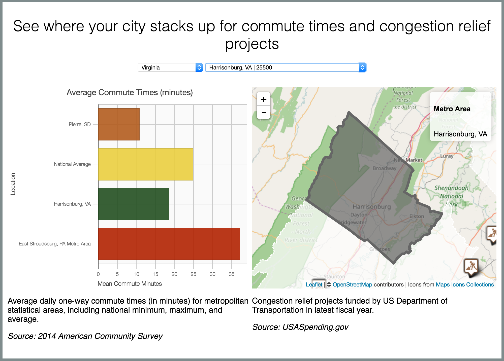

We schedule our day around it. We design our cities around it. We give so much of our lives to it. To many Americans, traffic is all of the above and more. We hate traffic even as it seems to grow worse every passing year. But how do we fare against the Americans across the nation? Is my commute the worst in the nation? Is it getting better or worse? These are all complicated questions that can be answered with freely public data. Data on commute times is collected by the Census Bureau's American Community Survey each year, and we'll access this data via [Data USA's](https://datausa.io/) convenient API. Spending data is provided by the Treasury Department on [USASpending.gov](https://www.usaspending.gov/Pages/Default.aspx). The resulting mashup can enable us to see the extent to which government spending through formula grants and related programs from the Department of Transportation aligns with high-congestion regions. The experts at [Deloitte](http://www2.deloitte.com/global/en.html) and [Datawheel][http://www.datawheel.us/] have provided a [Data Usability](https://www.commerce.gov/datausability/) tutorial making use of Data USA's API to build a widget to explore these questions.

In there [tutorial](https://commercedataservice.github.io/tutorial-congestion/), they walk you through all the steps of replicating our data-visualization which mashes up statistics on average commuting times with data on congestion relief projects funded by the Department of Transportation. You'll learn how to load the required software to build the mashup, how to use basic shell scripting commands to make a directory structure where your visualization app can live, how to pull the code for the app from our open-source code repository on GitHub, and how to run a simple web server.